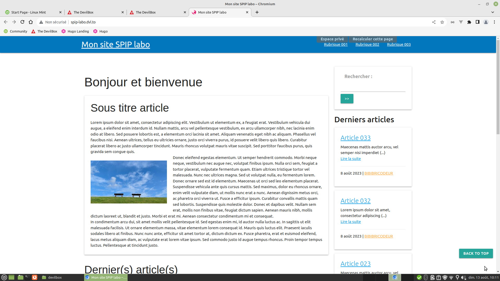

# squelettes-materialize

Squelette minimal et générique basé sur le framework [Materializecss](https://materializecss.com/) pour reprendrer en main le cms [SPIP](https://www.spip.net/fr_rubrique91.html).



## Installation

Créer ou adapter un fichier `mes_options.php` dans le dossier `config` puis écrire ou ajouter

```
<?php

# https://contrib.spip.net/Multi-squelettes
$GLOBALS['dossier_squelettes'] = 'squelettes-materialize';
```

## Usage

## Contributing
[makeareadme](https://www.makeareadme.com/)

## License
[Unlicense](https://choosealicense.com/licenses/unlicense/)
